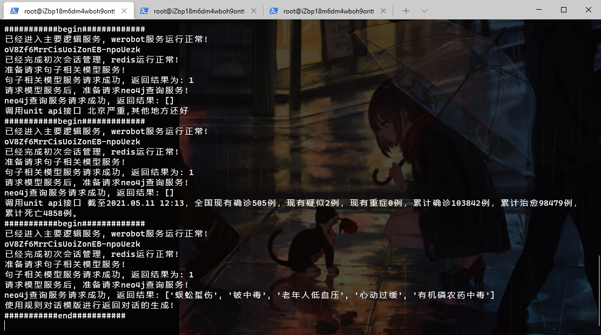
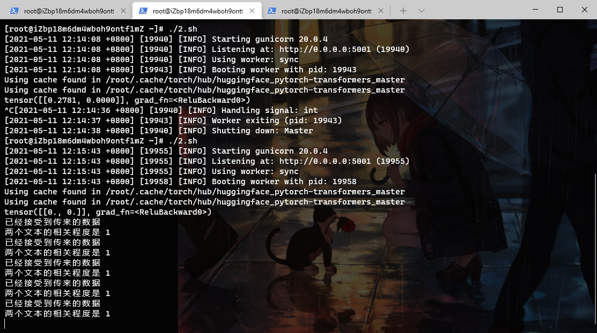
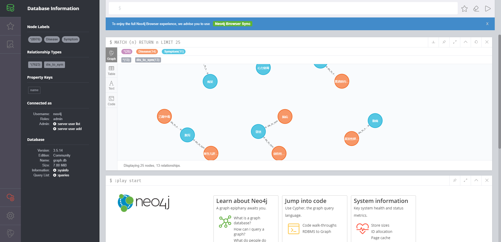

# 深度学习nlp毕设
作者:yrq

## 项目总体架构
（关注微信公众号华北理工AI助手 已经上线部署）

框架 采用 pytorch + Flask 框架+百度unit API

离线部分： 数据爬虫（PySpider）+ 数据清洗（ NER（命名实体识别模型）NE（命名实体审核模型））+ neo4j（ nosql 图数据库 ）

在线部分： werobot （对接微信服务器） + redis(在线缓存nosql数据库) + bert-chinsese(模型 优化调参 微整)

部署 （linux （阿里云centos 腾讯云centos） ，Gunicorn 搭配Flask控制单个进程 ， Supervisor服务监控器 保证整个项目进程运行流畅 ）
>项目分为两大模块

在线模块
on_line


离线模块：负责rnn模型训练和bilstm_crf模型训练
off_line

***


如果需要使用本项目的话

off_line只是帮助了解数据的清洗

只需搭建好neo4j图数据库和on_line下属的文件以及rnn_moderl下的reviewed文件
***
## 安装neo4j

neo4j图数据库的安装流程:

* 第一步: 将neo4j安装信息载入到yum检索列表.
```vim
cd /tmp
wget http://debian.neo4j.org/neotechnology.gpg.key
rpm --import neotechnology.gpg.key
cat <<EOF>  /etc/yum.repos.d/neo4j.repo
# 写入下面内容
[neo4j]
name=Neo4j RPM Repository
baseurl=http://yum.neo4j.org/stable
enabled=1
gpgcheck=1
```
* 第二步: 使用yum install命令安装.
```shell script
yum install neo4j-3.3.5
```
* 第三步: 修改配置文件内容 /etc/neo4j/neo4j.conf.
```shell script
# 数据库的存储库存储位置、日志位置等
dbms.directories.data=/var/lib/neo4j/data
dbms.directories.plugins=/var/lib/neo4j/plugins
dbms.directories.certificates=/var/lib/neo4j/certificates
dbms.directories.logs=/var/log/neo4j
dbms.directories.lib=/usr/share/neo4j/lib
dbms.directories.run=/var/run/neo4j

# 导入的位置
dbms.directories.import=/var/lib/neo4j/import

# 初始化内存大小
dbms.memory.heap.initial_size=512m

# Bolt 连接地址
dbms.connector.bolt.enabled=true
dbms.connector.bolt.tls_level=OPTIONAL
dbms.connector.bolt.listen_address=0.0.0.0:7687
```
* 第四步: 启动neo4j数据库.
>数据库启动
```shell script
neo4j start 
```
将rnn_model/structured/reviewed 的 reviewed文件夹上传到服务器
>将文件夹的内容写入neo4j图数据库中
```shell script
python write_neo4j.py
```
>数据库测试
```shell script
python test_neo4j.py
```

## on_line部分

redis安装
```shell script
yum install redis -y
pip install redis
```
redis启动
```shell script
redis-server
```
redis测试 (注意自己的目录 下面同理)
```shell script
python test_redis.py
```

gunicorn
由于采用python3使用gunicorn有问题
编写run_gunicorn.py解决此问题
```shell script
pip install gunicorn==20.0.4
```

flask安装
```shell script
pip install Flask==1.1.1
```


下面on_line文件夹全部上传到服务器部署即可 依次运行下面代码 需要开启不同的窗口（注意自己的目录）
```shell script
nohup python  ~/ai_doctor/on_line/wr.py   & 
python ~/ai_doctor/on_line/main_server/run_gunicorn.py -w 1 -b 0.0.0.0:5000 app:app 
python ~/ai_doctor/on_line/bert_server/run_gunicorn.py -w 1 -b 0.0.0.0:5001 app:app 
```
>同时请注意：

服务器的内存必须要4G以上 2G内存的话不够用

所以我解决的方案是架设两台2g内存的服务器，通过http通信

一台部署neo4j数据库

一台部署on_line文件的所有内容

>效果图







##拓展
setting_speed.py 利用清华源加速下载


作者的项目都是win10系统下用pycharm进行开发
模型训练完毕才上传至服务器进行部署


