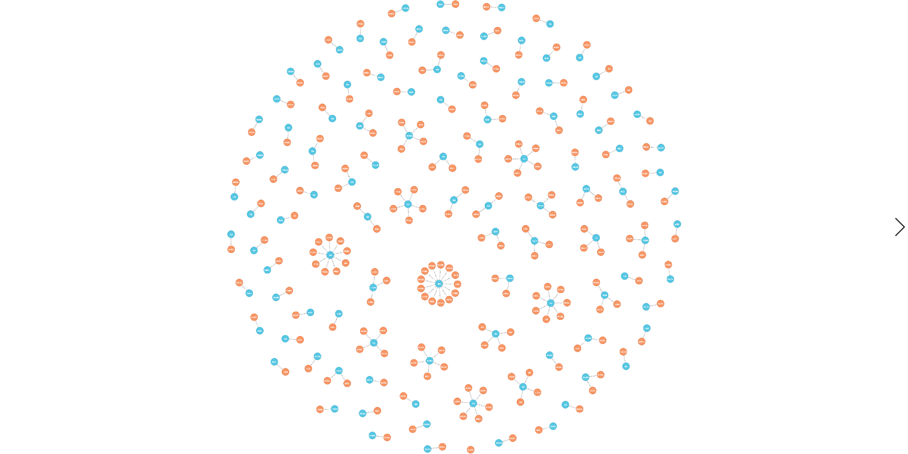

# 深度学习nlp毕设

>项目分为两大模块

在线模块
on_line


离线模块：负责rnn模型训练和bilstm_crf模型训练
off_line

***

如果需要使用本项目的话

off_line只是帮助了解数据的清洗

只需搭建好neo4j图数据库和on_line下属的文件以及rnn_moderl下的reviewed文件

##安装neo4j


将rnn_model/structured/reviewed 的 reviewed文件夹上传到服务器

>数据库启动
```shell script
neo4j start 
```
>将文件夹的内容写入neo4j图数据库中
```shell script
python write_neo4j.py
```
>数据库测试
```shell script
python test_neo4j.py
```

##on_line部分

下面on_line文件夹全部上传到服务器部署即可 依次运行下面代码 需要开启不同的窗口
```shell script
nohup python  ~/ai_doctor/on_line/wr.py   & 
python ~/ai_doctor/on_line/main_server/run_gunicorn.py -w 1 -b 0.0.0.0:5000 app:app 
python ~/ai_doctor/on_line/bert_server/run_gunicorn.py -w 1 -b 0.0.0.0:5001 app:app 
```
>同时请注意：

服务器的内存必须要4G以上 2G内存的话不够用

所以我解决的方案是架设两台2g内存的服务器，通过http通信

一台部署neo4j数据库

一台部署on_line文件的所有内容

>效果图





